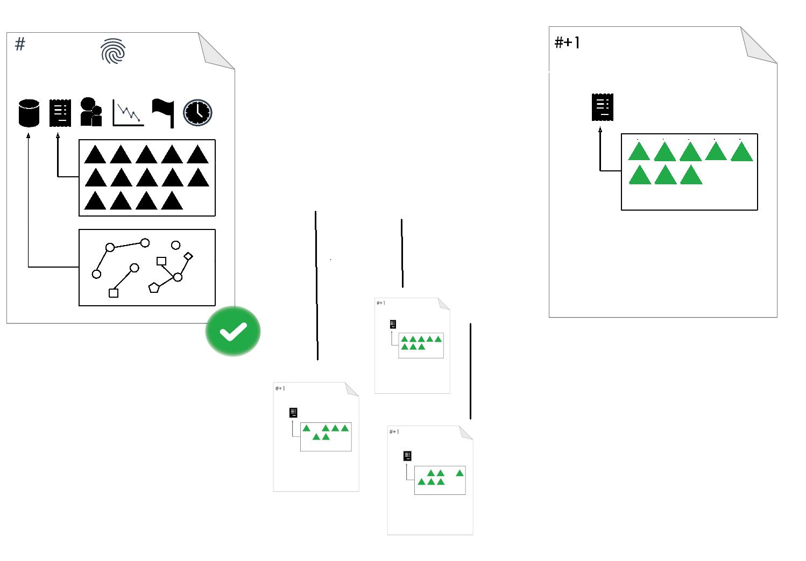
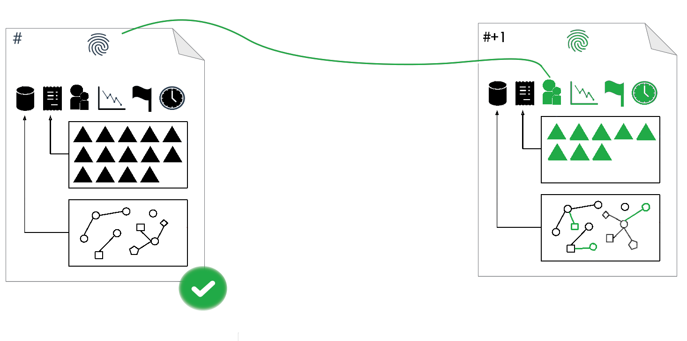

# Understanding Consensus

This topic describes the consensus process used to validate each ledger version as it is added to the XRP Ledger block chain.

Consensus is the most important property of any decentralized payment system. In traditional centralized payment systems, one authoritative administrator gets the final say in how and when payments occur. Decentralized systems, by definition, do not have an administrator to do that. Instead, decentralized systems like the XRP Ledger define a set of rules all participants follow. Every participant can agree on the exact same series of events and their outcome at any point in time. This set of rules is known as a _consensus protocol_.

## Consensus

The consensus process gathers proposed transactions on the XRP Ledger and generates a new ledger version with agreed upon changes.

The peer-to-peer XRP Ledger network includes a specialized type of server called a _validator_. Validators collaborate to propose and confirm transactions that generate a new ledger version.

Starting with the last validated ledger version, validators distribute a new ledger version based on transaction requests they have received. The proposed ledgers all have the same sequence number (previous sequence number plus one).

Validators then incorporate new transactions from other trusted validators, and remove transactions that are not recognized by other nodes. When 80% of the validator nodes agree on the transactions to include in the new ledger, all proposed ledger versions are dropped and a new one is created with the agreed upon transactions.

The XRP Ledger creates the new ledger version, including changes in state information based on the agreed upon transactions, the parent hash, the current available XRP, flags, and the close time. The ledger calculates the unique hash of the ledger version based on its own updated information.

The XRP Ledger's technology enables near real-time settlement (three to six seconds).